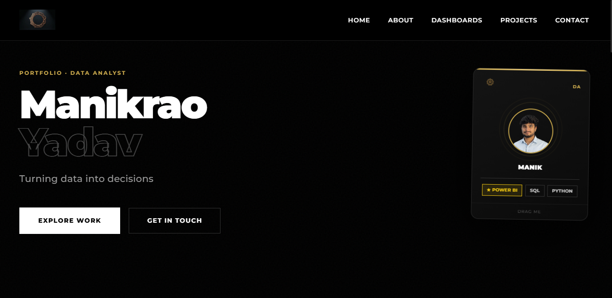

# Data Analyst Portfolio [Link](https://manikrao-yadav.github.io/portfolio/)

A modern, responsive portfolio website showcasing my data analytics projects, dashboards, and technical expertise.

### Preview

## About

This portfolio demonstrates my skills in data analysis, visualization, and business intelligence through interactive dashboards and real-world projects.

## Tech Stack

- HTML5
- CSS3
- JavaScript
- Montserrat Font

## Features

- Responsive design for all devices
- Interactive dashboard gallery
- Animated skills and statistics sections
- Contact form
- Smooth scroll navigation

## Projects Showcased

1. **Sales Performance Dashboard** - Power BI, SQL, DAX
2. **Customer Behavior Analytics** - Tableau, Python, Machine Learning
3. **Marketing Campaign Dashboard** - Power BI, Google Analytics, SQL
4. **Financial KPI Dashboard** - Tableau, SQL Server, ETL
5. **Supply Chain Optimization** - Python, Power BI, Forecasting
6. **HR Analytics Dashboard** - Tableau, R, Statistics

## Skills Highlighted

- Python
- SQL
- Power BI
- Excel
- Statistics

## Contact

- LinkedIn: www.linkedin.com/in/manikraoyadav
- GitHub: https://github.com/manikrao-yadav
- Email: manikraonyad127@gmail.com
